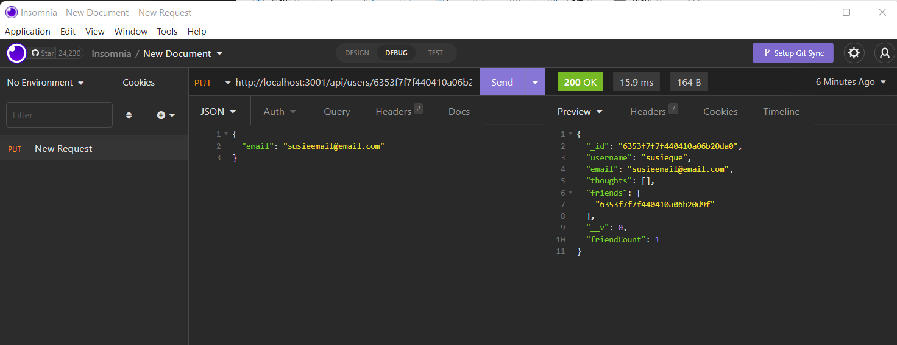

# 18 NoSQL: Social Network API

## Description

An **object relational mapping (ORM)** backend for e-commerce site.  This includes Express.js API to use Sequelize to interact with MySQL database. Four route files have been modified and are shown in the video. 

### Technologies Used

Express.js
JavaScript
MongoDB
Mongoose


### Screenshot



### Link to Deployed
```
git@github.com:bussudo/ecommercesiteBE.git

### Link to Videos:
https://drive.google.com/file/d/1aPTRqySa9Qpc51n8JiqCz4Cnxs_upZV0/view
https://drive.google.com/file/d/1CewI-hJmt81IP5RsgJkDW2bXTrttFUMY/view
https://drive.google.com/file/d/1g5W_015wZKZ0DDY2V1_vMXXjto2Po0Xy/view
https://drive.google.com/file/d/1s1hrCjFLQcLUaGy357P5PLFltJboI3RR/view
https://drive.google.com/file/d/1TaRSNUuK2JWsai2u8p3Kv-2lP-cmP2FO/view
https://drive.google.com/file/d/1MeM7bEMBVlcAXBzXPn3b5yQLFbzEvrkp/view
